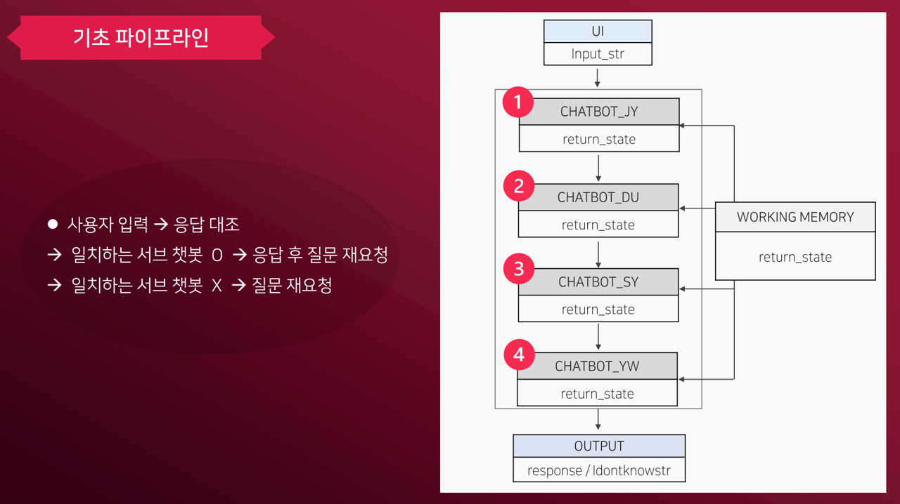
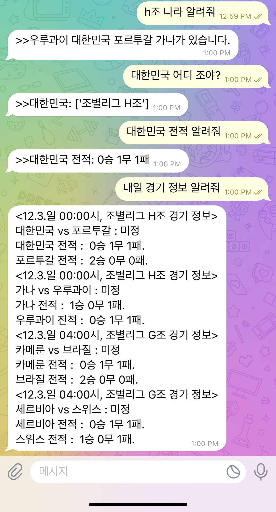
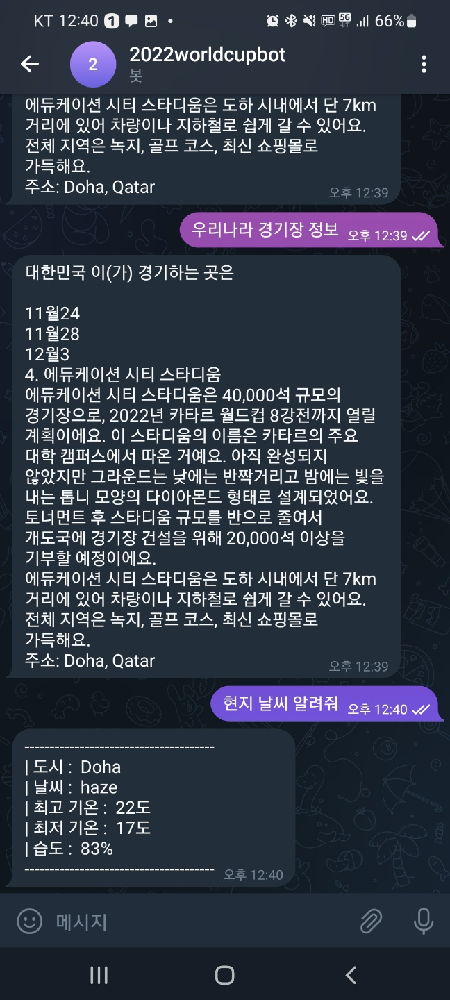

# SSU AI 2022-2

숭실대학교 AI 융합학부 인공지능개론 수업 팀프로젝트 과제인 규칙기반 챗봇 개발 프로젝트 입니다. 저희 팀은 [2022 카타르 월드컵 경기 정보 제공 챗봇]을 주제로 프로젝트를 진행하였습니다.

- 제공 기능
  - 경기장 정보
  - 조별 경기 일정 / 나라별 경기 일정
  - 조 구성 정보
  - 선수 정보
  - 승부 예측

> Presentation: [최종 보고서](./figure/4조%20최종%20보고서.pdf)

## 구성원

|  김도언  |박산야   |정재윤|한영욱|
| :----: | :----: | :----: | :----: |
|||||

## 파이프라인 오버뷰

## 작동 예시

<table>
  <tr>
    <td>
      
    </td>
    <td>
      
    </td>
  </tr>
</table>
